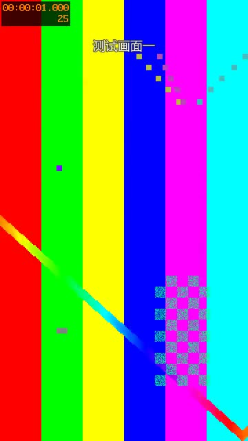

# Video Editing

> [2026-09-19账号增长报告](https://production-bucket.oss.aliyun.a4.fit/reports/temporary/swimming-account/20260919-071300/index.html)已发布：4类样本内容、3个教学账号对照、12个拍摄选题与可复制提示词。[阶段进度](docs/task-2026-09-19-account-growth.md)记录证据与未完成项。

> 长期交付要求：每批素材用含日期时分秒的独立OSS目录；同批所有版本与每轮提示词调教记录都归档。见[存储位置与执行规则](docs/oss-archive.md)。点播交付不能替代剪辑OSS归档。

> 2026-09-18 晚最新纠正：先梳理教学项目；序号按项目而非片段，合并重复深水探底，序号与名称同一行；底板待定。按视频类型、剪辑风格、专业术语三层整理提示词。今天只记录，下一次按[接续清单](docs/next-session-content-review.md)执行；此前v6规则与本条冲突时以本条为准。

> 2026-09-18 后续反馈：每个片段增加入场、出场动画和顺序编号，风格更活泼；保留本片教练原声、无配乐。重点是把经验固化为提示词，使后续只需简短反馈即可自主剪辑。见 [自主剪辑流程](docs/autonomous-editing.md)。


> 2026-09-18 最新反馈：本片用于10节游泳课的学习成果展示和抖音推广。放大动作名称并加底板、短转场、对照参考片核对教学术语、后续最新反馈为不要配乐、恢复清楚的教练原声；替代本日较早的配乐混音要求及下文 09-17 的透明底/硬切/静音设置。实际进度见 [本次迭代](./docs/iteration-2026-09-18.md)。旧例子仅保留回归用途。

当前优先完成本地剪辑、按反馈修改、上传 video-2022 并交付手机播放链接。手机全自助平台暂缓。

当前已从需求文档补到**可运行的开源引擎验证工作台**：素材探测 → 结构化方案 → 覆盖校验 → 中文字幕/转场/声音处理 → MP4 与质量报告。已有本地 video-2022 交付适配器；手机页面、服务器队列、订阅执行器仍未实现，剪辑平台尚未部署。

## 先运行，不需要模型 API 或 GPU

准备 Git、uv、Python 3.11–3.14、FFmpeg/ffprobe 和中文字体，然后在本仓库运行：

```sh
uv sync --locked
uv run editing doctor
uv run editing demo --simple
uv run ruff check --no-cache .
uv run pytest
```

`demo` 使用自动生成的合成素材，实际调用 vedit 和 FFmpeg，检查 MP4 后自动清理临时文件。它不是 AI 动作理解测试。要保留可看的演示，使用 `uv run editing demo --simple --output /交付目录/demo.mp4`。

首次安装固定 Git 提交的 vedit 和锁定依赖，需要网络。Python 依赖由 uv 共享缓存、硬链接复用；不下载大型识别模型、不读取模型登录状态、不调用付费 API。

[完整运行与交接手册](docs/agent-handoff.md) · [其他 agent 从这里开始](AGENTS.md)

下面是实际渲染的合成素材检查图，用来验证文字与片段切换，不是手机产品界面：



## 本次补齐的能力

- 通用 `Plan` 与 JSON Schema，不绑定执行者或聊天会话；生成覆盖表、输入散列和规则快照。
- 按泳姿、出发、转身、辅助练习、水中技能分类；必需内容不能默默遗漏。
- 原素材与参考片严格区分；以连续画面确认完整动作，ASR/OCR 只作辅助证据。
- 自动计算重叠转场后的时长，禁止为了凑时长偷偷加速或截断已标记的完整动作区间。
- 本次模板使用大号白字与半透明底板，每片段独立编号和标题进出动画，无预告和分类小字；支持原声、静音、音乐、旁白及音乐混原声。
- 复用固定提交的 vedit；适配 FFmpeg 9 参数变化，使用 Pillow 叠加中文字幕，兼容缺少 drawtext/libass 的环境。
- 输出技术检查与语义/观感审核分开。技术成功不会自动标记“所有动作正确”。

## 两个平台、两个仓库

| 平台 | 职责 |
| --- | --- |
| [video-2022](https://github.com/makewheels/video-2022) | 视频点播：上传、存储、转码、播放、下载 |
| video-editing | 剪辑：手机入口、工程、要求、规则、任务、版本、编辑方案、执行及质量报告 |

原素材和成片不提交 Git。用户只有现有编程助手订阅，没有模型 API 凭证；服务端订阅执行路线要单独验证，不能把付费 API 当默认前提。优先开源复用，不先重写完整编辑器。

## 文档与下一步

| 文档 | 内容 |
| --- | --- |
| [需求基线](docs/requirements.md) | 已确认目标、用户最新反馈、未决问题 |
| [架构与数据归属](docs/architecture.md) | 独立剪辑平台与已有点播平台的边界 |
| [服务端实施设计](docs/execution-design.md) | 任务包、状态机、版本、租约、手机 API 与验收 |
| [工具链](docs/toolchain.md) | FFmpeg 之外需要什么；必需、下一步与可选能力 |
| [开源调研与实测](docs/research.md) | 固定版本、实际故障与验证边界 |
| [开发交接](docs/agent-handoff.md) | 可直接执行的命令、输入输出与错误处理 |
| [下一步清单](docs/next-steps.md) | 分阶段工作与具体退出条件 |
| [游泳完整覆盖提示词](prompts/swimming-full-coverage.md) | 场景模板，明确反馈自动同步项目规则 |
| [推荐简洁方案](examples/simple-plan.json) / [旧功能示例](examples/plan.json) / [JSON Schema](schemas/edit-plan.schema.json) | 编码与剪辑 agent 共用的结构化协议 |

当前验证范围请看 `docs/research.md`。本地实现、自动测试、真实素材语义审核、部署和手机真机验收分别记录。

## 最新反馈如何进入下一次剪辑

明确的修改意见直接同步项目提示词、示例和必要代码，不等用户再次要求“记住”。09-18最新反馈要求大字幕、底板、每片段入场出场动画和序号、教学名称，声音以稍后的“不要配乐、教练原声听清”为准，替代早先配乐混音及09-17的透明底、硬切与静音；仍不显示预告，分类保留在方案中。效果仍需用户确认，不能把技术检查通过当作满意。

本次新方案参考 `examples/animated-numbered-plan.json`：`caption_style=badge`、`number_clips=true`、`motion_style=energetic`、`audio.mode=source`、`encoding_profile=compact`、`next_label_seconds=0`；转场必须避开完整动作证据。`simple-plan.json` 保留为旧样式回归示例。compact 使用 CPU libx264 fast / CRF 23 / maxrate 8M / bufsize 16M。旧方案缺省字段保留 card / high_quality，以免重新渲染时悄悄改变样式；旧示例用于功能回归，不代表当前审美默认值。

使用 [剪辑与交付提示词](prompts/edit-and-deliver.md)，按 [交付手册](docs/delivery.md) 安装可选依赖并复用 video-cli 登录。上传需要用户授权；READY、播放列表和首尾分片解码都通过后才交付链接。命令验证不等于手机真机验收。

[本次迭代与完成边界](docs/iteration-2026-09-17.md) 记录实际证据。推送或创建 PR 不代表获得合并授权。
