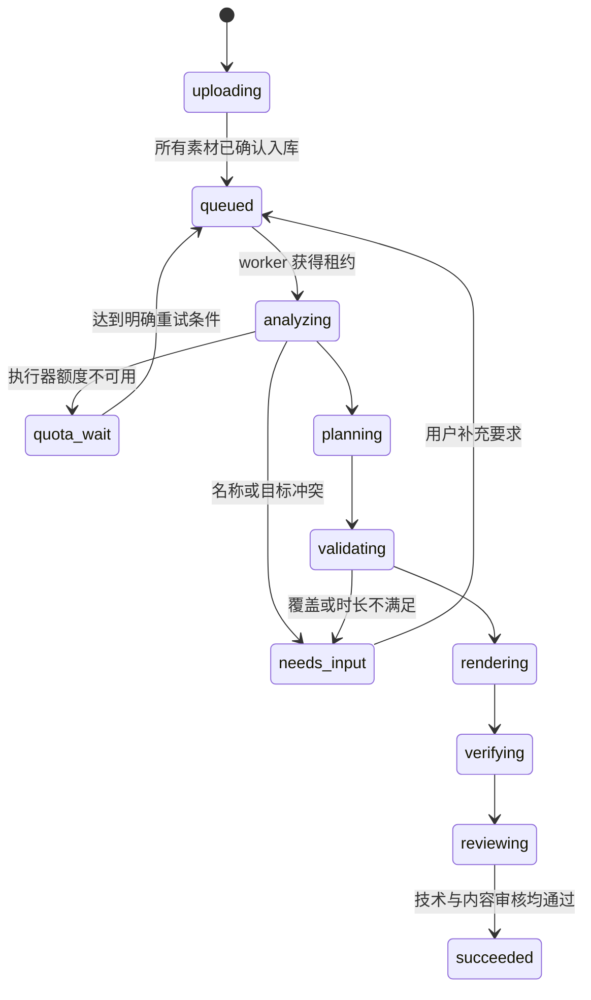

# 服务端实施方案与验收边界

> 2026-09-17 更新：下文是未来服务端实施设计，尚未实现，当前暂缓。已有本地剪辑与交付命令没有队列、租约或跨进程自动恢复能力。

以下接口、数据库和队列是下一阶段设计，不是当前已部署功能。当前工作台是独立渲染子进程，可作为平台 worker 的执行能力复用。

## 从任务包恢复，不从聊天恢复

任务包至少保存：工程 ID、版本、素材 ID/角色/散列、需求原文、选用的规则快照、内容清单与证据、方案 JSON、未决问题、预算、执行器配置引用、引擎版本。凭证保存在独立秘密存储，只保存引用。

现有订阅如何在服务器登录、能否非交互执行、实际能否看图或视频、额度耗尽如何恢复，都需要单独验证。不要把订阅当通用模型 API，不自动降级到别的模型或变更付费路线。

建议 `AgentRunner` 契约：

```text
preflight() -> ready | needs_login | quota_wait | unavailable
run(task_package, deadline, budget) -> analysis + plan | needs_input | failure
cancel(run_id) -> stopped
```

执行器必须能处理独立任务包、结构化结果、退出码和超时；CLI 参数从服务器白名单配置获取。先用不改素材的小任务验证 `--help` 支持的实际参数，再开真实任务，避免“定时注册成功，但启动命令报错”的重复问题。

## 状态机



任意活动阶段都可转入 `failed` 或 `cancelled`；取消需终止整个任务进程组。失败状态保存可重试阶段和原因，不写成功标记。用户关闭手机页面不取消服务端任务。

任务使用 `idempotency_key` 防止手机重复提交。worker 使用心跳和到期租约；抢占时递增 fencing token，旧 worker 即使结束也不能发布结果。重试从最近已验证的持久产物继续，不重新下载或无条件重做所有模型分析。当前 CLI 是单次命令，以上逻辑尚待实现。

## 数据与版本

建议表：`projects`、`assets`、`project_assets`、`project_versions`、`jobs`、`job_attempts`、`preferences`、`artifacts`。内容清单、证据、方案、规则快照和质量报告按工程版本存储；视频二进制仍归点播平台。

- 修改生成新版本，记录 `parent_version`；旧成片不覆盖。
- 偏好优先级：本次明确要求 > 工程规则 > 用户明确保存的长期偏好 > 默认模板。
- 单条建议和不确定推断只放工程反馈，不能自动污染长期偏好。
- 版本回退是切换工程的选中版本，不是破坏旧记录。
- 代理、转写、镜头信息按素材散列和工具/模型版本缓存；模型文件全局一份只读缓存，任务产生的数据有独立归属和生命周期。

## 手机 API 建议

| 操作 | 提议接口 | 关键要求 |
| --- | --- | --- |
| 建工程 | `POST /projects` | 私人入口认证 |
| 关联素材 | `POST /projects/{id}/assets` | 区分 source/reference；视频 ID 归属校验 |
| 提交剪辑 | `POST /projects/{id}/jobs` | 幂等键、规则快照、预算与版本 |
| 查进度 | `GET /jobs/{id}`，可加 SSE | 真实阶段；不能拿模型思考时间伪造百分比 |
| 取消 | `POST /jobs/{id}/cancel` | 后端终止执行；停止资源占用 |
| 预览下载 | `GET /projects/{id}/versions/{v}/artifacts` | 私有、短期签名链接、Range、正确 MIME/文件名 |
| 修改 | `POST /projects/{id}/revisions` | 第二阶段；只改指定内容，生成新版本 |

移动端第一期建议只有上传、描述要求、进度、预览、下载。复杂时间线不是前提。下载到“文件”和保存到“相册”不是同一个动作，必须做真机验证；不要承诺网页能静默写入相册。

## 任务隔离与交付

模型只能提交结构化方案，不接受任意 shell、任意滤镜脚本、任意 URL 或宿主绝对路径。上传下载由受限 adapter 完成；worker 使用非特权用户、只读原素材、独立临时目录、超时和磁盘/内存/并发限额。解析外来媒体前还需要服务器网络与文件系统隔离；当前本地 CLI 路径校验不能替代生产隔离。

完成视频必须先校验再上传私有对象，点播入库成功后才把产物与成功状态作为一个发布步骤提交。任务残留扫描只删除已过期且无活动租约的临时资源。永久删除素材或版本需要独立保留策略，不跟随任务失败自动执行。

## 五层验收

1. 技术：完整解码、尺寸/帧率/编码/方向、音轨、时长和文件散列。
2. 结构：每项必需内容有出处、完整动作区间未被切断或转场遮住、参考片使用符合要求。
3. 语义：实际画面、动作名称、类别、字幕和旁白对应；清单没有遗漏独有内容。
4. 观感：连续播放检查节奏、关键动作、切口前后、手机字号和遮挡；不只抽中间帧。
5. 产品：手机提交后关页仍运行，重新打开能恢复状态，下载真成片，版本可追踪。

测试夹具至少覆盖：竖屏旋转、可变帧率、无音轨、中文路径、长短混合素材、参考片误用、转写错位、额度中断、进程崩溃、重复提交、下载过期、并发修改。HDR 当前显式拒绝，未来先加入色调映射再扩大支持范围。
